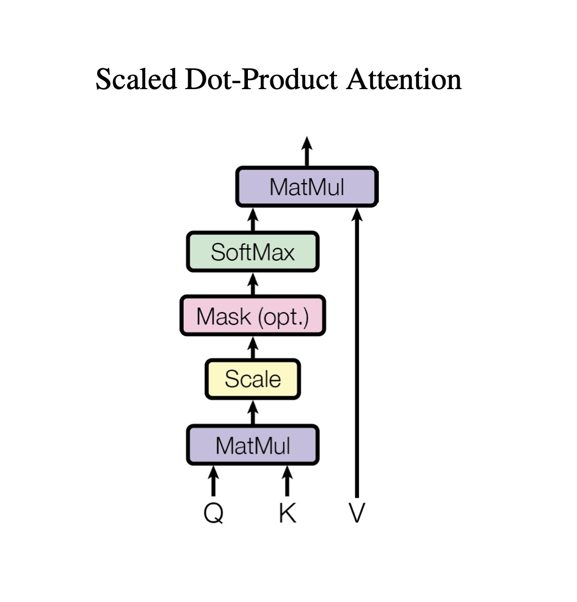
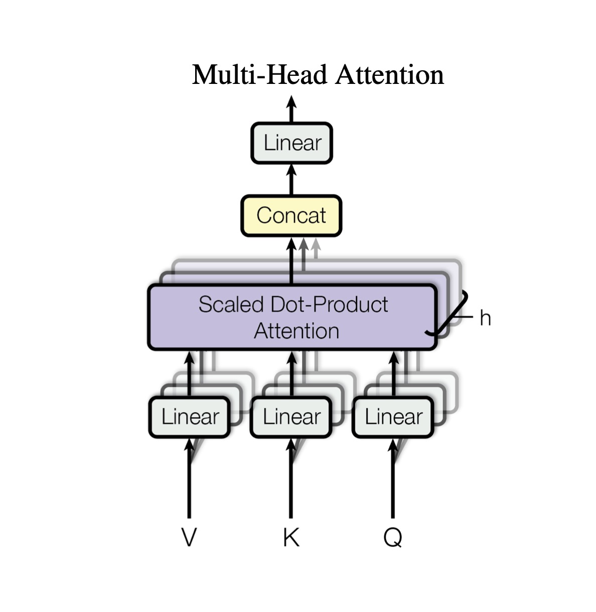
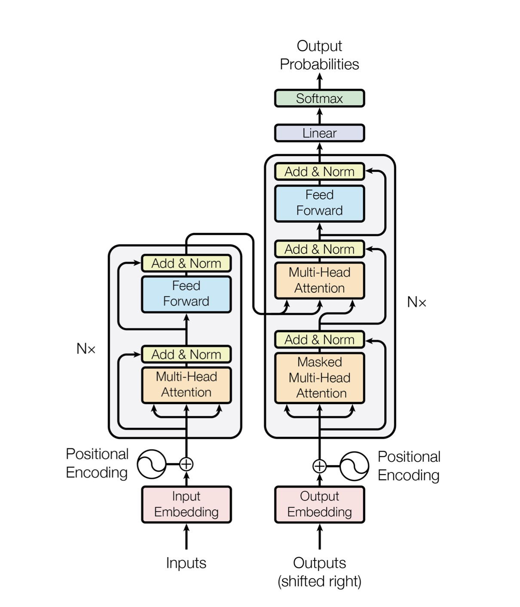
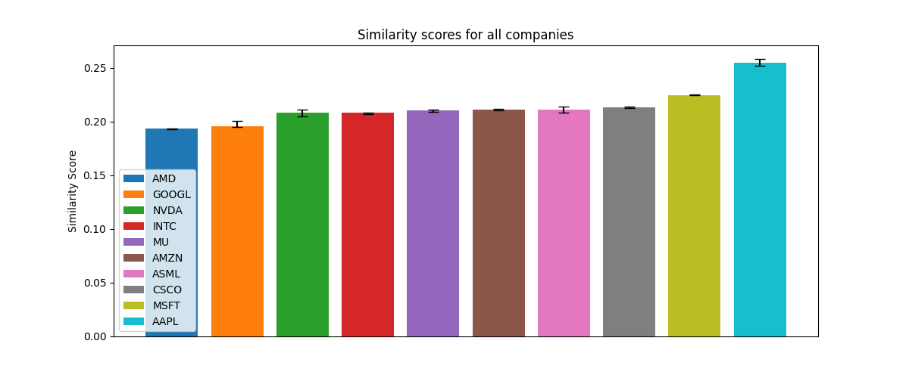
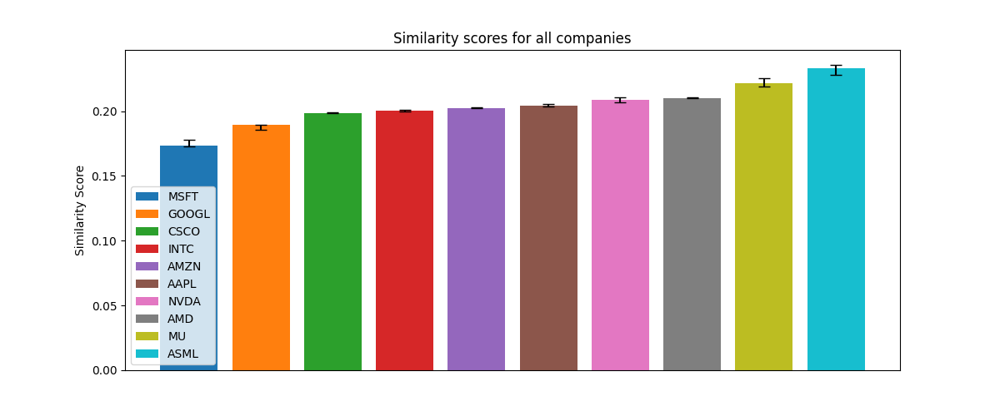
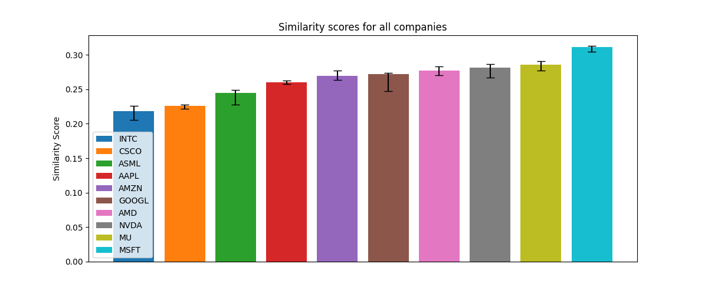

- M. Beekenkamp

# An Investigation into the Potential Sentiment Disparity in Earnings Calls between Prepared and Unprepared Sections.

## Introduction

Every quarter investors eagerly await company's earnings calls to hear management's perspective on a company's business performance. These earnings calls typically consist of two sections: a presentation, which is a prepared speech by management, and a Q&A section, during which management need to answer select shareholder questions.

Acknowledging the importance of these transcripts, companies spend a lot of time ensuring that the presentation is precisely worded to convey the company's health in the correct tone, however, during the Q&A section questions need to be answered in real time. Given that high level executives are generally the ones answering these questions, perhaps their answers to these questions are more revealing than the prepared sections.

If there is extra information revealed during the prepared sections, it would be interesting to see which company are most susceptible to revealing additional information. Moreover, if the prepared sections and unprepared aren't similar, perhaps there is also a sentiment disparity between the two sections. The presence of such a disparity could be a useful signal for investors to consider when making investment decisions.

Skip ahead to the **Method Section** [here](#method), or the **Results Section** [here](#results).

## Use Guide

This code was written using Python 3.11.4, and requires the following packages:

- tensorflow
- numpy
- scipy
- pandas
- matplotlib
- scikit-learn
- nltk
- tqdm

>[!TIP]
>If you don't have these packages installed, refer to the **installation guide below** for a bash script that will install all of these packages.

<details>
<summary>Installation Guide</summary>

### Installation

To install the required packages, you will need Python 3.8–3.11 and pip version >19.0 (or >20.3 for macOS) installed. For mac users on Apple Silicon, you will also need to install the `tensorflow-macos` package so that the code can run on GPU.

To check if you have a compatible version of Python installed, run the following command in the terminal:

```bash
python --version
```

And to update pip, run the following command in the terminal:

```bash
pip install --upgrade pip
```

Then to install packages, run the following bash script:

```bash
chmod +x install_packages.sh
./install_packages.sh
```

</details>

### Running the code

To run the code, you have two options. You can either specify the company you want to analyse, or you can run the code on all companies.

To prevent the runtime from being too long, you are required to specify the type of embedding you want to use. The options are:

```bash
python main.py --embedding [EMBEDDING]
```

Where `--embedding` can be one of the following options:
- `tfidf`: Term Frequency-Inverse Document Frequency [(TF-IDF)](#tf-idf)
- `lstm`: Long Short-Term Memory [(LSTM)](#lstm)
- `gru`: Gated Recurrent Unit [(GRU)](#gru)
- `sa`: Self-Attention Mechanism [(SA)](#self-attention-mechanism)

Eg. to run the code with the LSTM embedding, you would run the following command in the terminal:

```bash
python main.py --embedding lstm
```

Additionally, if you have a specific company you want to analyse, you can simply run the following command in the terminal:

```bash
python main.py --embedding sa --company
```

After which you will see `>> ` in the terminal, denoting that you are in the REPL.

You can then enter the symbol of the company you want to analyse. For the dataset used in this project, the company symbol's are as follows:
- AAPL (Apple)
- AMD (Advanced Micro Devices)
- AMZN (Amazon)
- ASML (ASML Holding)
- CSCO (Cisco)
- GOOGL (Alphabet)
- INTC (Intel)
- MSFT (Microsoft)
- MU (Micron Technology)
- NVDA (Nvidia)

By entering the company's ticker symbol, you can analyse the sentiment of the earnings call for that company. After running the code, you will have the opportunity to enter another company to analyse, or to exit the program.

To exit the program at any time, you can simply type `:exit` inside the REPL.

## Data Sources and Descriptions

All data is downloaded from a [kaggle data set](https://www.kaggle.com/datasets/ashwinm500/earnings-call-transcripts/data) [^1], as the data. The data is 160 .txt files, one for each earnings call. Each file contains the prepared Presentation and the unprepared Q&A section of the earnings call for a specific company. In [`preprocessing.py`](Code/preprocessing.py) the data is cleaned, tokenised, lemmatised, and split into training and testing data with a 80-20 split. This works out to be training on 2016-2019 data with the 2020 data being used for testing. In order to work with the data, the data is split into the aforementioned two sections, presentation and Q&A, however the data is then further split into paragraphs for the presentation, and for the Q&A the questions and answers are isolated from each other. The paragraphs are intended to approximate the segmentation of the presentation into unique concepts or ideas.

## Method

This projects includes three main methods of analysis:
1. [Document Similarity Analysis](#document-similarity-analysis)
    - This section compares the similarity between the prepared presentation and the unprepared Q&A section of each company's earnings calls. Three different embedding techniques are employed, both classical embeddings and learned embeddings. After the embeddings are generated, the similarity between the presentation and Q&A sections is calculated using cosine similarity.
2. Transformer Sentiment Analysis
    - This section uses a pre-trained transformer model to generate sentiment labels for the earnings call for each company. 
    - These generated labels are subsequently regarded as 'true' and are used as the training labels for the LSTM, GRU, and Transformer models. My models are used to generate new sentiment labels, which are in turn used to claculate the sentiment disparity between the prepared and unprepared sections.
3. Pre-trained Sentiment Analysis
    - This section uses a pre-trained sentiment analysis model as a starting point, and then fine-tunes the model for our dataset.
    - This is to explore the efficacy of pre-trained models, and the advantages of language models trained on large corpora of text data.

As of now, the [first](#document-similarity-analysis) method has been implemented, and the results are discussed [below](#results). The other two methods are still in development.

### Embedding Techniques

Although there exists a substantial body of literature on text embeddings, specifically which are the most effective, I explored the following embedding techniques for this project:

#### TF-IDF Embeddings

A common technique for creating text embeddings is to use the Term Frequency-Inverse Document Frequency (TF-IDF) method. TF-IDF notably does not capture sequential or contextual relationships between words, focusing instead on the frequency of terms in the document. This makes it well-suited for basic similarity computations but may struggle with capturing semantic meaning or context. See the Maths Review section for more information on [TF-IDF](#tf-idf).

#### Contextual Embeddings

By utilising [RNN layers](#rnns), and [self-attention mechanisms](#self-attention-mechanism), contextual embeddings can be created. These embeddings represent not only the word itself but also the context in which it appears.

Given that these are learned embeddings, they need to be trained and we need something that constitutes a label. However, the earnings call is just text and doesn't have any labels we have two options:
1. We can ask the model to predict the next token in a sequence given the previous tokens. Although this is a common approach, our dataset is quite small and this approach would likely lead to overfitting. Moreover, we are not interested in generating text, but rather in understanding the 'meaning' of the text.
2. [Autoencoders](#autoencoders). Autoencoders ask the model to encode, and then decode the input data, with the difference between the input and output being the loss function. 

I chose to implement the second option, given the small dataset size and the fact that we are not interested in generating text. The training procedure is as follows:

1. Data is [preprocessed](Code/preprocessing.py).
2. The data is split into training and testing data using an 80-20 split. This works out to be training on 2016-2019 data with the 2020 data being used for testing.
3. The tokenised data is then fed into the [variational autoencoder model](Code/autoencoder.py), with the chosen [embedding technique](Code/embeddings.py) being used to encode the data. 
4. The model tries to reconstruct the input data, with the loss function being the difference between the input and output data.
5. The trained embeddings are passed to the [similarity analysis](Code/similarity.py).

### Document Similarity Analysis

The document similarity analysis focuses on the similarity between the prepared presentation and the unprepared Q&A section of each company's earnings calls. Three different embedding techniques are employed, encompassing both classical and learned embeddings. 

For each earnings call, the average similarity score between a question's answer and the most analogous paragraph from the presentation is calculated. The objective is to simulate the process of evaluating whether an answer aligns with the content discussed in the earnings call, particularly in the section referenced by the question. Specifically, for each question-answer pair, the paragraph in the presentation with the highest cosine similarity to the question is identified, and the cosine similarity between this paragraph and the answer is computed.

These similarity scores are then averaged across all question-answer pairs in a given earnings call to obtain an overall similarity score for that document; and then averaged across all earnings calls for a given company to obtain an overall similarity score for that company. 

### Maths Review

If you want to skip to the **Results Section** click [here](#results).

#### Classical Methods

##### TF-IDF

Term Frequency-Inverse Document Frequency (TF-IDF) is a numerical statistic that is intended to reflect how important a word is to a document in a collection or corpus. It is often used as a weighting factor in information retrieval and text mining. The TF-IDF value increases proportionally to the number of times a word appears in the document and is offset by the number of documents in the corpus that contain the word, which helps to adjust for the fact that some words appear more frequently in general.

The formula for TF-IDF is as follows:

$$ w_{i,j} = tf_{i,j} \cdot log(\frac{N}{df_i}) $$

Where:
- $w_{i,j}$ is the TF-IDF weight of term $i$ in document $j$;
- $tf_{i,j}$ is the term frequency of term $i$ in document $j$;
- $N$ is the total number of documents in the corpus;
- $df_i$ is the number of documents in the corpus that contain term $i$;

##### Cosine Similarity

Cosine similarity is a metric used to determine how similar two vectors are. In this case, the vectors are the TF-IDF vectors of the prepared presentation and Q&A section of the earnings call for each company. Cosine similarity measures the cosine of the angle between two vectors projected in a multi-dimensional space. The formula for cosine similarity is as follows:
```math
 \textsf{cosine similarity} = \frac{\textbf{A} \cdot \textbf{B}}{\|\textbf{A}\| \times \|\textbf{B}\|}
```

Where:
- $\textbf{A}$ is the TF-IDF matrix for the presentation;
- $\textbf{B}$ is the TF-IDF matrix for the Q&A section;


#### RNNs

A Recurrent Neural Network (RNN) is a type of neural network that is designed to handle sequential data. It is particularly useful for natural language processing tasks, as it can remember information from previous time steps and use it to make predictions at the current time step. The two main types of RNNs are the [LSTM](#lstm) and [GRU](#gru) networks.

<p align="center">
     <br>
    <em> Diagram of RNNs.</em>
</p>

Image Source [^2]

##### LSTM

A Long Short-Term Memory (LSTM)[^6] network is a type of RNN that is designed to handle long-term dependencies in sequential data. It is particularly useful for natural language processing tasks, as it can remember information from previous time steps and use it to make predictions at the current time step. The basic structure of an LSTM is as follows:

<p align="center">
    
    <br>
    <em> Diagram of an LSTM Gate.</em>
</p>

Image Source [^3]

Where:
- $x_t$ is the current input at timestep $t$;
- $h_{t-1}$ and $C_{t-1}$ are the previous hidden and cell states;

```math
\begin{align*}
    f_t &= \sigma \left( W_f x_t + U_f h_{t-1} + b_f \right) & \textsf{Forget Module} \\
    i_t &= \sigma \left( W_i x_t + U_i h_{t-1} + b_i \right) & \textsf{Remember Module}\\
    \tilde{C}_t &= \tanh \left( W_c x_t + U_c h_{t-1} + b_c \right) & \textsf{New Memory}\\
    C_t &= f_t \odot C_{t-1} + i_t \odot \tilde{C}_t  & \textsf{Cell State Update}\\
    o_t &= \sigma \left( W_o x_t + U_o h_{t-1} + b_o \right) & \textsf{Output Module}\\
    h_t &= o_t \odot \tanh(C_t)  & \textsf{Output, Hidden State Update}\\
\end{align*}
```

And:
- A $\textsf{Forget Module}$ allows the LSTM to keep or forget information from the previous hidden state;
- A $\textsf{Remember Module}$ decides which values to update in the cell state;
- A $\textsf{New Memory}$ creates a vector of new candidate values that could be added to the cell state;
- A $\textsf{Cell State Update}$ module updates the cell state;
- An $\textsf{Output Module}$ creates the output;
- An $\textsf{Output, Hidden State Update}$ module updates the hidden state.

##### GRU

A Gated Recurrent Unit (GRU) [^4] is a type of RNN that is designed to handle long-term dependencies in sequential data. It is particularly useful for natural language processing tasks, as it can remember information from previous time steps and use it to make predictions at the current time step. The basic structure of a GRU is as follows:

<p align="center">
    
    <br>
    <em> Diagram of a GRU Gate. </em>
</p>

Image Source [^5]

Where:

- $x_t$ is the current input at timestep $t$;
- $h_{t-1}$ is the previous hidden state.

```math
\begin{align*}
    z_t &= \sigma \left( W_z x_t + U_z h_{t-1} + b_z \right) & \textsf{Update Gate Vector}\\
    r_t &= \sigma \left( W_r x_t + U_r h_{t-1} + b_r \right) & \textsf{Reset Gate Vector}\\
    \hat{h}_t &= \tanh \left( W_h x_t + r_t \odot ( U_h h_{t-1}) + b_h \right) & \textsf{Candidate Activation Vector}\\
    h_t &= z_t \odot h_{t-1} + (1 - z_t) \odot \hat{h}_t  & \textsf{Output, Hidden State Update}\\
\end{align*}
```
And:
- The $\textsf{Update Gate Vector}$ ($z_t$) determines how much of the previous hidden state to retain and how much of the new candidate activation to use;
- The $\textsf{Reset Gate Vector}$ ($r_t$) decides which parts of the previous hidden state should be forgotten;
- The $\textsf{Candidate Activation Vector}$ ($\hat{h}_t$) represents the new candidate hidden state, which is a combination of the current input and a modified previous hidden state;
- The $\textsf{Output, Hidden State Update}$ module updates the hidden state ($h_t$) based on the update gate vector and the candidate activation vector.


#### Transformer Models

##### Self-Attention Mechanism

The self-attention mechanism is a key component of transformer models. [^7] It allows the model to weigh the importance of different words in a sentence when making predictions. The self-attention mechanism works by calculating a score for each word in the sentence based on its relationship with the other words in the sentence. These scores are then used to calculate a weighted sum of the word embeddings, which is used as the input to the next layer of the model. The basic structure of the self-attention mechanism is as follows:

<p align="center">
    
    <br>
    <em> Scaled Dot-Product Attention. </em>
</p>

Image Source [^7]

```math
\begin{align*}
    \textsf{Attention}(Q, K, V) &= \textsf{softmax} \left( \frac{QK^T}{\sqrt{d_k}} \right) V
\end{align*}
```

Where:
- $Q$ is the query matrix;
- $K$ is the key matrix;
- $V$ is the value matrix;
- $d_k$ is the dimension of the key matrix.

##### Multi-Head Attention

Parallelizes computation and captures dependencies between distant words efficiently, making it well-suited for capturing long-range dependencies.
Offers superior performance in capturing semantic meaning and context compared to RNN-based approaches, particularly for tasks requiring understanding of broader contexts or relationships within the text.

Multi-head attention is a variant of the self-attention mechanism that allows the model to focus on different parts of the input sequence simultaneously. It works by splitting the query, key, and value matrices into multiple heads, calculating the attention scores for each head, and then concatenating the results. The basic structure of multi-head attention is as follows:

<p align="center">
    
    <br>
    <em> Multi-Head Attention consists of several attention layers running in parallel. </em>
</p>

Image Source [^7]

```math
\begin{align*}
    \textsf{MultiHead}(Q, K, V) &= \textsf{Concat}(\textsf{head}_1, \ldots, \textsf{head}_h) W^O \\
    \textsf{where } \textsf{head}_i &= \textsf{Attention}(QW_i^Q, KW_i^K, VW_i^V)
\end{align*}
```

Where:
- $QW_i^Q$, $KW_i^K$, and $VW_i^V$ are the query, key, and value matrices for head $i$;
- $W^O$ is the output weight matrix.

And:
```math
W_iQ \in \mathbb{R}^{d_{\text{model}} \times d_k}, \quad W_iK \in \mathbb{R}^{d_{\text{model}} \times d_k}, \quad W_iV \in \mathbb{R}^{d_{\text{model}} \times d_v}, \quad \textsf{and} \quad W_O \in \mathbb{R}^{h \times d_v \times d_{\text{model}}}.
```

<p align="center">
    
    <br>
    <em> Transformer model architecture. </em>
</p>

Image Source [^7]

#### Autoencoders

Autoencoders are a type of neural network that are used for unsupervised learning tasks. They work by an encoder network that maps the input data into a latent space representation and a decoder network that reconstructs the input data from this representation. The main objective of an autoencoder is to learn a compressed, distributed encoding of the input data such that the reconstruction from this representation is as close to the original input as possible. The basic structure of an autoencoder is as follows:

<p align="center">
    
    <br>
    <em> Schematic structure of an autoencoder with 3 fully connected hidden layers. The code (z, or h for reference in the text) is the most internal layer. </em>
</p> 

Image Source [^8]

```math
\begin{align*}
    \textsf{Encoder}(x) &= \sigma(Wx + b) \\
    \textsf{Decoder}(z) &= \sigma(W'z + b')
\end{align*}
```

Where:
- $x$ is the input data;
- $z$ is the encoded representation of the input data;
- $W$ and $W'$ are the weight matrices;
- $b$ and $b'$ are the bias vectors.

##### Variational Autoencoders

Variational Autoencoders (VAEs) extend the basic autoencoder by incorporating probabilistic modeling into the encoding process. Instead of directly encoding the input data into a fixed representation, VAE learns to encode the input data into a probability distribution in the latent space.

VAE imposes a constraint on the distribution of the latent variables to follow a predefined distribution, typically a Gaussian distribution. This constraint encourages the latent space to have certain desirable properties, such as smoothness and continuity.

During training, VAE aims to maximise the likelihood of generating the input data under the learned distribution in the latent space while simultaneously minimising the difference between the generated data and the original input data.

The basic structure of a VAE is as follows:

<p align="center">
    
    <br>
    <em> The basic scheme of a variational autoencoder. </em>
</p>

Image Source [^9]

```math
\begin{align*}
    \textsf{Encoder}(x) &= \mu, \sigma = \textsf{NN}(x) \\
    z &\sim \mathcal{N}(\mu, \sigma) \\
    \textsf{Decoder}(z) &= \textsf{NN}(z)
\end{align*}
```

Where:
- $\mu$ and $\sigma$ are the mean and standard deviation of the latent distribution;
- $z$ is the latent variable sampled from the distribution;
- $\mathcal{N}(\mu, \sigma)$ is the Gaussian distribution with mean $\mu$ and standard deviation $\sigma$.

Technically, a unsymmetrical variational autoencoder is used in this project. This largely follows the structures explained above, but with an unsymmetrical autencoder, the encoder and decoder components are not symmetrical. As shown by Sun et al. (2015) [^10], this can lead to better results. 

## Results

The table below displays the cosine similarity scores obtained using the three different text embedding methods.

**Average cosine similarity scores between Presentation and Q&A sections for all companies:**
<!-- | Company   | TF-IDF Embeddings    | GRU Embeddings     | LSTM Embeddings    | Transformer Embeddings |
|-----------|----------------------|--------------------|--------------------|------------------------|
| Apple     | 0.00620438641453739  | 0.2543580234050751 | 0.2044840306043625 | 0.26002272963523865    |
| AMD       | 0.003693839986579608 | 0.19325938820838928| 0.21022605895996094| 0.27665042877197266    |
| Amazon    | 0.0015476103006760518| 0.21068359911441803| 0.20251555740833282| 0.26905152201652527    |
| ASML      | 0.0040679289470081145| 0.21110592782497406| 0.23345239460468292| 0.2442130297422409     |
| Cisco     | 0.0036762236455800375| 0.2133038192987442 | 0.19871598482131958| 0.22546233236789703    |
| Google    | 0.004305539921222904 | 0.1957850456237793 | 0.1893100142478943 | 0.2715793550014496     |
| Intel     | 0.0027762305489947518| 0.20789632201194763| 0.20047979056835175| 0.21826229989528656    |
| Microsoft | 0.003374062957867656 | 0.2245478332042694 | 0.17322051525115967| 0.31099265813827515    |
| Micron    | 0.005058904864883506 | 0.210518479347229  | 0.22128818929195404| 0.2852003872394562     |
| NVIDIA    | 0.0025780134669955166| 0.20786771178245544| 0.2084471434354782 | 0.28165680170059204    | -->

| Company                           | TF-IDF Embeddings    | GRU Embeddings     | LSTM Embeddings    | Transformer Embeddings |
|-----------------------------------|----------------------|--------------------|--------------------|------------------------|
| Apple                             | 0.00620              | 0.254              | 0.204              | 0.260                  |
| AMD                               | 0.00369              | 0.193              | 0.210              | 0.277                  |
| Amazon                            | 0.00155              | 0.211              | 0.203              | 0.269                  |
| ASML                              | 0.00407              | 0.211              | 0.233              | 0.244                  |
| Cisco                             | 0.00368              | 0.213              | 0.199              | 0.225                  |
| Google                            | 0.00431              | 0.196              | 0.189              | 0.272                  |
| Intel                             | 0.00278              | 0.208              | 0.200              | 0.218                  |
| Microsoft                         | 0.00337              | 0.225              | 0.173              | 0.311                  |
| Micron                            | 0.00506              | 0.211              | 0.221              | 0.285                  |
| NVIDIA                            | 0.00258              | 0.208              | 0.208              | 0.282                  |
|-----------------------------------|----------------------|--------------------|--------------------|------------------------|
| **Average**                       | **0.00373**          | **0.213**          | **0.204**          | **0.264**              |
| **Normalised Standard Deviation** | **0.352**            | **0.0798**         | **0.0805**         | **0.107**              |

The most striking component of this table is the substantial jump in score from the classical to the learned embeddings. TF-IDF embeddings (below) consistently showcase lower similarity scores across all companies. This observation suggests that while TF-IDF embeddings provide useful insights for large corpora, and provide a useful fundamental representation of textual data, they struggle to capture the nuanced semantic relationships present within earnings call transcripts. What this means is that these embeddings aren't representative of the answer-paragraph pair. When looking at the normalised standard deviation, we see that TF-IDF embeddings have standard deviations 3 to 4.5 times greater than the learned embeddings.

<p align="center">
    
    <br>
    <em> Cosine Similarity Scores for TF-IDF Embeddings, error bars represent the minimum and maximum scores.</em>
</p>

On the other hand, all of the learned embeddings performed exceptionally well with a two order of magnitude improvement relative to the TF-IDF embeddings. The GRU embeddings represent the first contextual embeddings used in this project, see below. Immediately you see a notable improvement in the average similarity score compared to the TF-IDF embeddings, with roughly two orders of magnitude improvement across the board. As shown visually by the small error bars, GRU embeddings had the lowest normalised standard deviation indicating that the GRU embeddings provided robust similarity scores.

<p align="center">
    
    <br>
    <em> Cosine Similarity Scores for GRU Embeddings, error bars represent the minimum and maximum scores.</em>
</p>

The improvements shown in the GRU embeddings are replicated improved upon by the LSTM embeddings:

<p align="center">
    
    <br>
    <em> Cosine Similarity Scores for LSTM Embeddings, error bars represent the minimum and maximum scores.</em>
</p>

The transformer embeddings, below, have the highest similarity scores albeit with slightly higher standard deviations to the RNNs. This is testament to their ability to generate contextual embeddings, even from a limited dataset, and suggests that they are the most effective at capturing the relationship between the presentation and Q&A sections. However, the improvement is not as significant as the improvement from the TF-IDF embeddings to the GRU embeddings, this plateauing of performance can be seen as a sign that we are converging on an effective representation, hinting at the idea that the presentation and Q&A sections are not as similar as we might have initially thought. This warrants further investigation with a pre-trained model, before making any definitive statements.

<p align="center">
    
    <br>
    <em> Cosine Similarity Scores for Transformer Contextual Embeddings, error bars represent the minimum and maximum scores.</em>
</p>

Although the methods aren't rigorous enough to make any concrete statements about the contextual meaning of the results, there are some interesting insights: The plateauing of performance could indicate that the results are close to the correct value, if this is the case the low similarity scores are suggestive of the idea that the presentation and Q\&A sections are not as similar as we might have initially thought. Secondly if we rank the companies based on their similarity scores, NVIDIA, Apple, and ASML are consistently at the top with average rankings of 3.00, 3.50, and 4.25 respectively. On the other end of this metric Cisco and Google (tied), Amazon, and Intel have the lowest average rankings of 6.50, 6.75, and 8.00. When looking only at the contextual embeddings we see similar results: Micron in first, and then Apple, ASML, and Microsoft all tied for second (Microsoft was 4th in the full rankings), with average rankings of 3.33 and 4.33. At the bottom we had Cisco, Google and Intel, with average rankings of 6.67, 7.67, and 8.00. Looking at these results, alongside the bar charts we see that across methods the models rank the companies in a similar fashion, suggesting that there is a latent connection with some companies consistently revealing more during their Q&As than others. This however warrants further investigation with a pre-trained model before making any definitive statements.

## Conclusion

The analysis of cosine similarity scores corroborates the existing body of literature demonstrating the effectiveness of these techniques in capturing semantic relationships. Moreover, my findings underscore the substantial improvement in performance offered by learned embeddings, and specifically the positional encoding, when compared to classical methods such as TF-IDF embeddings.

Learned contextual embeddings provided an substantial improvement in both the variance and the overall score for the embeddings highlighting their prevalence in state-of-the-art models today. Transformer's self-attention mechanism enables them to capture contextual information more effectively across longer sequences of text, and the multi-headed attention mechanism allows the model to focus on different parts of the input sequence simultaneously, capturing dependencies between distant words efficiently, leading to more robust representations. Although this corpus was not large enough to replicate these findings, the transformer's ability to parallelise computation allows for greater scalability allowing for the model to be trained on larger datasets. Anecdotally, the transformer model seemed to train faster than the RNNs, which is likely due to the parallelisation of the attention mechanism which can be leveraged by the Oscar's GPUs. Thank you Brown!

The plateauing of performance observed with transformer embeddings alongside the loosely consistent internal rankings of companies across methods suggests that there might be a meaningful disparity between the information gained from the presentation versus the Q&A.

Overall, the results highlight the importance of selecting appropriate text embedding methods for analysing earnings call transcripts. Future research could explore the integration of pre-trained models and transitioning the focus towards sentiment analysis and disparity. Given the promising results hinted at by the current state of the project there is reason to believe that by leveraging advanced text embedding techniques, researchers can gain deeper insights into the dynamics of corporate communications and investor relations, ultimately contributing to more informed decision-making processes in financial markets.

## Looking Forward
Beyond the scope of this project, there are a number of ways in which this project could be expanded. Here are some of ideas that I already have are:

### Contrastive Loss
By integrating the similarity calculations into the loss function, we can explicitly train the model to maximise the similarity between the presentation and Q&A sections. Specifically, to maximise the similarity between a question and the section of the presentation that is most similar to that question. This would likely lead to more accurate embeddings without impacting the performance of the similarity calculations, which are calculated between the answer and the aforementioned section of the presentation.

## Known Issues
Currently, there are two known issues with the code:
1. [`preprocessing.py`](Code/preprocessing.py), func: `clean_data` Currently there are three cases in which the there will be a question with no associated answer. In these cases the question answer pair are discarded.

2. [`preprocessing.py`](Code/preprocessing.py), func: `clean_data` Currently there are handful of instances, particularly in the AMZN files, where questions/answers aren't tokenised. Although the root cause of this issue is unknown, it seems to occur when there are multiple questions being asked in succession. In these cases the question/answer are tokenised again.


## References
[^1]:
    `Data/Dataset/`: <br>
    [Quarterly Earnings Call Transcripts for 10 NASDAQ companies from 2016-2020](https://www.kaggle.com/datasets/ashwinm500/earnings-call-transcripts/data) (released: 03/07/2023) <br><br>
[^2]:
    `Data/Images/RNNs.jpg`: <br>
    Kalia, Robin (2021) “Recurrent Neural Networks (RNN), Gated Recurrent Units (GRU), and Long Short-Term Memory (LSTM).”
    [LinkedIn](https://www.linkedin.com/pulse/recurrent-neural-networks-rnn-gated-units-gru-long-short-robin-kalia/)
    (released: 07/02/2021)<br><br>
[^3]:
    `Data/Images/LSTM_gate.jpg`: <br>
    Varsamopoulos, Savvas, Koen Bertels, and Carmen Almudever (2018) “Designing neural network based decoders for surface codes,”
    [ResearchGate](https://www.researchgate.net/publication/329362532_Designing_neural_network_based_decoders_for_surface_codes)
    (released: 01/11/2018)<br><br>
[^4]:
    Chung, Junyoung, Caglar Gulcehre, KyungHyun Cho, and Yoshua Bengio (2014) “Empirical Evaluation of Gated Recurrent Neural Networks on Sequence Modeling.” <br>
    ArXiv:[1412.3555](http://arxiv.org/abs/1412.3555)
    (released: 11/12/2014)<br><br>
[^5]:
    `Data/Images/GRU_gate.jpg`: <br>
    Agarap, Abien Fred (2017) “A Neural Network Architecture Combining Gated Recurrent Unit (GRU) and Support Vector Machine (SVM) for Intrusion Detection in Network Traffic Data,”
    [ResearchGate](https://www.researchgate.net/publication/319642918_A_Neural_Network_Architecture_Combining_Gated_Recurrent_Unit_GRU_and_Support_Vector_Machine_SVM_for_Intrusion_Detection_in_Network_Traffic_Data)
    (released: 01/10/2017)<br><br>
[^6]:
    Hochreiter, Sepp and J{\"u}rgen Schmidhuber (1997) “Long short-term memory,” Neural computation, 9 (8), 1735–1780
    [Paper](http://www.bioinf.jku.at/publications/older/2604.pdf)
    (released: 1997)<br><br>

[^7]:
    `Data/Images/Attention_diagram.jpg`, `Data/Images/Multiheaded_Attention_diagram.jpg`, `Data/Images/Transformer_diagram.jpg`: <br>
    Vaswani, Ashish, Noam Shazeer, Niki Parmar, Jakob Uszkoreit, Llion Jones, Aidan N. Gomez, Lukasz Kaiser, and Illia Polosukhin (2017) “Attention Is All You Need,” CoRR,abs/1706.03762
    ArXiv:[1706.03762](http://arxiv.org/abs/1706.03762)
    (released: 12/06/2017)<br><br>

[^8]:
    `Data/Images/Autoencoder_structure.png`: <br>
    By Chervinskii - Own work, CC BY-SA 4.0, https://commons.wikimedia.org/w/index.php?curid=45555552 <br><br>

[^9]:
    `Data/Images/VAE_Basic.png`: <br>
    By EugenioTL - Own work, CC BY-SA 4.0, https://commons.wikimedia.org/w/index.php?curid=107231101 <br><br>

[^10]:
    Sun, Yanan, Hua Mao, Quan Guo, and Zhang Yi. “Learning a Good Representation with Unsymmetrical Auto-Encoder.” Neural Computing and Applications 27, no. 5 (July 24, 2015): 1361–67. <br>
    Paper: [10.1007/s00521-015-1939-3](https://doi.org/10.1007/s00521-015-1939-3).
    (released: 24/07/2015)<br><br>
