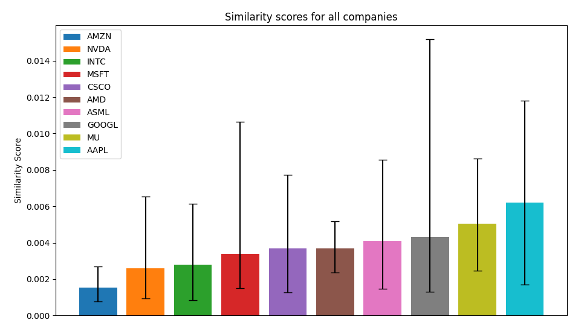

- M. Beekenkamp

# An Investigation into the Potential Sentiment Disparity in Earnings Calls between Prepared and Unprepared Sections.

## Introduction

Every quarter investors eagerly await company's earnings calls to hear management's perspective on a company's business performance. These earnings calls typically consist of two sections: a presentation, which is a prepared speech by management, and a Q&A section, during which management need to answer select shareholder questions. 

Acknowledging the importance of these transcripts, companies spend a lot of time ensuring that the presentation is precisely worded to convey the company's health in the correct tone, however, during the Q&A section questions need to be answered in real time and are perhaps more revealing to the true state of the company. 

So, perhaps there is an information advantage to be exploited by performing sentiment analysis on each segment separately potentially exposing 'truer' beliefs. To begin with I want to look at the sentiment disparity between the two sections, but this project can be expanded to see which section is more illuminating, or if the transcript should be digested as a whole for the most accurate interpretation.

## Use Guide

This code was written in Python 3.11.4, and uses the following packages:

- tensorflow
- numpy
- scipy
- pandas
- matplotlib
- scikit-learn
- nltk

>[!TIP]
>If you don't have these packages installed, refer to the **installation guide below** for a bash script that will install all of these packages.

<details>
<summary>Installation Guide</summary>

### Installation

To install the required packages, you will need Python 3.8–3.11 and pip version >19.0 (or >20.3 for macOS) installed. For mac users on Apple Silicon, you will also need to install the `tensorflow-macos` package so that the code can run on GPU.

To check if you have a compatible version of Python installed, run the following command in the terminal:

```bash
python --version
```

And to update pip, run the following command in the terminal:

```bash
pip install --upgrade pip
```

Then to install packages, run the following bash script:

```bash
chmod +x install_packages.sh
./install_packages.sh
```

</details>

### Running the code

To run the code, you have two options. You can either specify the company you want to analyse, or you can run the code on all companies. To run the code on all companies, you can run the following command in the terminal:

```bash
python main.py
```

However, if you have a specific company you want to analyse, you can simply run the following command in the terminal:

```bash
python main.py --company
```

After which you will see `>> ` in the terminal, denoting that you are in the REPL.

You can then enter the symbol of the company you want to analyse. For the dataset used in this project, the company symbol's are as follows:
- AAPL (Apple)
- AMD (Advanced Micro Devices)
- AMZN (Amazon)
- ASML (ASML Holding)
- CSCO (Cisco)
- GOOGL (Alphabet)
- INTC (Intel)
- MSFT (Microsoft)
- MU (Micron Technology)
- NVDA (Nvidia)

By entering the company's ticker symbol, you can analyse the sentiment of the earnings call for that company. After running the code, you will have the opportunity to enter another company to analyse, or to exit the program.

To exit the program at any time, you can simply type `:exit` inside the REPL.

## Data Sources and Descriptions

All data is downloaded from a [kaggle data set](https://www.kaggle.com/datasets/ashwinm500/earnings-call-transcripts/data) [^1], as the data. The data is 160 .txt files, one for each earnings call. Each file contains the prepared Presentation and the unprepared Q&A section of the earnings call for a specific company. In [`preprocessing.py`](Code/preprocessing.py) the data is cleaned, tokenised, lemmatised, and split into training and testing data with a 80-20 split. This works out to be training on 2016-2019 data with the 2020 data being used for testing. In order to work with the data, the data is split into the aforementioned two sections, presentation and Q&A, however the data is then further split into paragraphs for the presentation, and for the Q&A the questions and answers are isolated. This is to allow for a more granular analysis of the data.

<!-- TODO: Will likely use BERT or another pre-trained model alongside my own sentiment analysis model to compare the two.  -->

## Method

<!-- TODO: Explain the method used to analyse the data. -->

This projects includes three main methods of analysis:
1. Document Similarity Analysis
    - This section compares the similarity between the prepared presentation and the Q&A section of the earnings call for each company. This is achieved via TF-IDF embeddings, doc2vec embeddings, and a custom embedding method, which are then used to calculate cosine similarity.
2. Transformer Sentiment Analysis
    - This section uses a pre-trained transformer model to generate sentiment labels for the prepared presentation and Q&A section of the earnings call for each company. 
    - These are used as the training labels for the RNN, LSTM, and GRU models. Then the transformer models are used to generate new sentiment labels.
3. Pre-trained Sentiment Analysis
    - This section uses a pre-trained sentiment analysis model as a starting point, and then fine-tunes the model for our dataset.

### Embedding Techniques

#### TF-IDF Embeddings

A common technique for creating text embeddings is to use the Term Frequency-Inverse Document Frequency (TF-IDF) method. See the Maths Review section for more information on [TF-IDF](#tf-idf).

### Document Similarity Analysis

Once the textual content is represented using these embedding techniques, cosine similarity is calculated between corresponding segments of the presentation and the Q&A section. Specifically, for a given question answer pair, I take the section (paragraph) of the presentation which is most similar to the question, and then calculate the cosine similarity between that paragraph and the question's answer.


### Maths Review

If you want to skip this click [here](#results).

#### Classical Methods

##### TF-IDF

Term Frequency-Inverse Document Frequency (TF-IDF) is a numerical statistic that is intended to reflect how important a word is to a document in a collection or corpus. It is often used as a weighting factor in information retrieval and text mining. The TF-IDF value increases proportionally to the number of times a word appears in the document and is offset by the number of documents in the corpus that contain the word, which helps to adjust for the fact that some words appear more frequently in general.

The formula for TF-IDF is as follows:

$$ w_{i,j} = tf_{i,j} \times log(\frac{N}{df_i}) $$

Where:
- $w_{i,j}$ is the TF-IDF weight of term $i$ in document $j$;
- $tf_{i,j}$ is the term frequency of term $i$ in document $j$;
- $N$ is the total number of documents in the corpus;
- $df_i$ is the number of documents in the corpus that contain term $i$;

##### Cosine Similarity

Cosine similarity is a metric used to determine how similar two vectors are. In this case, the vectors are the TF-IDF vectors of the prepared presentation and Q&A section of the earnings call for each company. Cosine similarity measures the cosine of the angle between two vectors projected in a multi-dimensional space. The formula for cosine similarity is as follows:
```math
 \textsf{cosine similarity} = \frac{\textbf{A} \cdot \textbf{B}}{\|\textbf{A}\| \times \|\textbf{B}\|}
```

Where:
- $\textbf{A}$ is the TF-IDF matrix for the presentation;
- $\textbf{B}$ is the TF-IDF matrix for the Q&A section;


#### RNNs

A Recurrent Neural Network (RNN) is a type of neural network that is designed to handle sequential data. It is particularly useful for natural language processing tasks, as it can remember information from previous time steps and use it to make predictions at the current time step. The two main types of RNNs are the [LSTM](#lstm) and [GRU](#gru) networks.

<p>
     <br>
    <em> Diagram of RNNs.</em>
</p>
[^2]

##### LSTM

A Long Short-Term Memory (LSTM) network is a type of RNN that is designed to handle long-term dependencies in sequential data. It is particularly useful for natural language processing tasks, as it can remember information from previous time steps and use it to make predictions at the current time step. The basic structure of an LSTM is as follows:

- $x_t$ is the current input at timestep $t$.
- $h_{t-1}$ and $c_{t-1}$ are the previous hidden and cell states.

```math
\begin{align*}
    f_t &= \sigma \left( W_f x_t + U_f h_{t-1} + b_f \right) & \textsf{Forget Module} \\
    i_t &= \sigma \left( W_i x_t + U_i h_{t-1} + b_i \right) & \textsf{Remember Module}\\
    \tilde{c}_t &= \tanh \left( W_c x_t + U_c h_{t-1} + b_c \right) & \textsf{New Memory}\\
    c_t &= f_t \odot c_{t-1} + i_t \odot \tilde{c}_t  & \textsf{Cell State Update}\\
    o_t &= \sigma \left( W_o x_t + U_o h_{t-1} + b_o \right) & \textsf{Output Module}\\
    h_t &= o_t \odot \tanh(c_t)  & \textsf{Output, Hidden State Update}\\
\end{align*}
```

<p>
    
    <br>
    <em> Diagram of an LSTM Gate.</em>
</p>
[^3]

##### GRU

A Gated Recurrent Unit (GRU) [^4] is a type of RNN that is designed to handle long-term dependencies in sequential data. It is particularly useful for natural language processing tasks, as it can remember information from previous time steps and use it to make predictions at the current time step. The basic structure of a GRU is as follows:


- $x_t$ is the current input at timestep $t$.
- $h_{t-1}$ is the previous hidden state.

```math
\begin{align*}
    z_t &= \sigma \left( W_z x_t + U_z h_{t-1} + b_z \right) & \textsf{Update Gate Vector}\\
    r_t &= \sigma \left( W_r x_t + U_r h_{t-1} + b_r \right) & \textsf{Reset Gate Vector}\\
    \hat{h}_t &= \tanh \left( W_h x_t + r_t \odot ( U_h h_{t-1}) + b_h \right) & \textsf{Candidate Activation Vector}\\
    h_t &= z_t \odot h_{t-1} + (1 - z_t) \odot \hat{h}_t  & \textsf{Output, Hidden State Update}\\
\end{align*}
```

<p>
    
    <br>
    <em> Diagram of a GRU Gate. </em>
</p>
[^5]

## Results

<!-- TODO: Explain the results of the analysis. -->

**Average Cosine Similarity Scores between Presentation and Q&A sections for all companies:**


<p>
    
    <br>
    <em> Cosine Similarity Scores for TF-IDF Embeddings, error bars represent the minimum and maximum scores.</em>
</p>

The large error bars suggest that, according to the TF-IDF embeddings, the similarity between the presentation and Q&A sections varies greatly between each report. 

Company | TF-IDF Embeddings
--------|------------------
Apple   | 0.00620438641453739
Micron  | 0.005058904864883506
Google  | 0.004305539921222904
ASML    | 0.0040679289470081145
AMD     | 0.003693839986579608
Cisco   | 0.0036762236455800375
Microsoft | 0.003374062957867656
Intel   | 0.0027762305489947518
NVIDIA  | 0.0025780134669955166
Amazon  | 0.0015476103006760518

## Conclusion

<!-- TODO: Summarise the findings and suggest future expansion. -->

## Known Issues
Currently, there are two known issues with the code:
1. [`preprocessing.py`](Code/preprocessing.py), func: `clean_data` Currently there are three cases in which the there will be a question with no associated answer. In these cases the question answer pair are discarded.

2. [`preprocessing.py`](Code/preprocessing.py), func: `clean_data` Currently there are handful of instances, particularly in the AMZN files, where questions/answers aren't tokenised. Although the root cause of this issue is unknown, it seems to occur when there are multiple questions being asked in succession. In these cases the question/answer are tokenised again.


## References
[^1]:
    `Data/Dataset/`: <br>
    [Quarterly Earnings Call Transcripts for 10 NASDAQ companies from 2016-2020](https://www.kaggle.com/datasets/ashwinm500/earnings-call-transcripts/data) (released: 03/07/2024) <br><br>
[^2]:
    `Data/Images/RNNs.jpg`: <br>
    Kalia, Robin (2021) “Recurrent Neural Networks (RNN), Gated Recurrent Units (GRU), and Long Short-Term Memory (LSTM).”
    [LinkedIn](https://www.linkedin.com/pulse/recurrent-neural-networks-rnn-gated-units-gru-long-short-robin-kalia/)
    (released: 07/02/2021)<br><br>
[^3]:
    `Data/Images/LSTM_gate.jpg`: <br>
    Varsamopoulos, Savvas, Koen Bertels, and Carmen Almudever (2018) “Designing neural network based decoders for surface codes,”
    [ResearchGate](https://www.researchgate.net/publication/329362532_Designing_neural_network_based_decoders_for_surface_codes)
    (released: 01/11/2018)<br><br>
[^4]:
    Chung, Junyoung, Caglar Gulcehre, KyungHyun Cho, and Yoshua Bengio (2014) “Empirical Evaluation of Gated Recurrent Neural Networks on Sequence Modeling.” <br>
    ArXiv:[1412.3555](http://arxiv.org/abs/1412.3555)
    (released: 11/12/2014)<br><br>
[^5]:
    `Data/Images/GRU_gate.jpg`: <br>
    Agarap, Abien Fred (2017) “A Neural Network Architecture Combining Gated Recurrent Unit (GRU) and Support Vector Machine (SVM) for Intrusion Detection in Network Traffic Data,”
    [ResearchGate](https://www.researchgate.net/publication/319642918_A_Neural_Network_Architecture_Combining_Gated_Recurrent_Unit_GRU_and_Support_Vector_Machine_SVM_for_Intrusion_Detection_in_Network_Traffic_Data)
    (released: 01/10/2017)<br><br>
